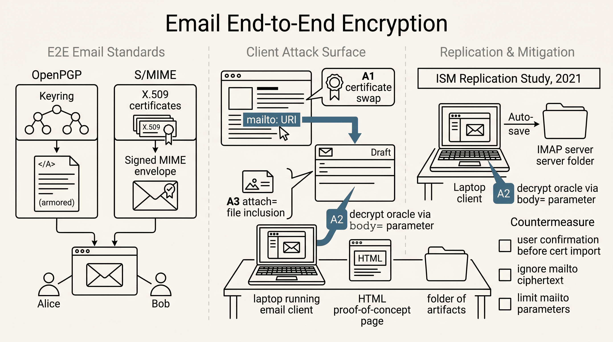

# Applied Cryptography: Email End-to-End Encryption

[](#)
[](report/Email_Final_Report.pdf)
[](LICENSE)

An Independent Study Module at **Ashoka University**, completed by **Abhinav Nakarmi** and **Kuber Shahi**, under the supervision of **Prof. Mahavir Jhawar**. This repository hosts the [final report](report/Email_Final_Report.pdf), proof-of-concept artifacts, and screenshots from that work.

## Overview

We replicated three classes of practical attacks against email encryption — key replacement, decrypt/sign oracles, and key exfiltration — following Müller et al., then evaluated countermeasures for each. The overview figure below maps this progression: the encryption standards involved, the client-side vulnerabilities exposed through `mailto:` URI handling, and the mitigations we discuss.



That starting point — encryption applied inside the email client, independent of how messages travel across the network — is where every attack class in this study begins. Two standards dominate that space, and our work targets how clients implement them rather than the cryptography underneath.

**OpenPGP** uses a decentralized web-of-trust model — users exchange public keys, and messages are wrapped in armored ciphertext blocks that clients encrypt and decrypt locally. **S/MIME** takes a different route, extending MIME with X.509 certificates and a PKI-based trust model to sign and seal email content. Despite their different designs, both aim to give senders and recipients confidentiality and authenticity beyond what ordinary email transport provides.

With that context in place, the central question becomes not whether the crypto holds, but whether the clients handling it can be misled. The attacks studied here do not break the underlying cryptography — they exploit weaknesses in key exchange, draft auto-save behavior, and proprietary `mailto:` URI parameters in email client implementations. We tested multiple clients including Thunderbird (with Enigmail 2.1.6), Postbox, and eM Client.

## Reference Paper

> **Mailto: Me Your Secrets. On Bugs and Features in Email End-to-End Encryption**  
> Jens Müller, Marcus Brinkmann, Damian Poddebniak, Sebastian Schinzel, Jörg Schwenk  
> [PDF](https://www.nds.ruhr-uni-bochum.de/media/nds/veroeffentlichungen/2020/08/15/mailto-paper.pdf)

| Class | Name | Description |
|-------|------|-------------|
| **A1** | Key replacement | Silently replace S/MIME certificates in transit |
| **A2** | Decrypt/sign oracles | Abuse `mailto:` + auto-saved drafts to decrypt or sign arbitrary content |
| **A3** | Key exfiltration | Exfiltrate OpenPGP secret keys via proprietary `attach=` parameters |

## Research Questions

1. How do email clients handle new S/MIME certificates — do they auto-import and replace existing keys?
2. Do clients store draft messages on IMAP servers unencrypted despite PGP/S/MIME being configured?
3. Can email clients be abused as decryption or signing oracles via `mailto:` links?
4. Do clients support `mailto:` features that attach local files (e.g., keyrings)?

## Countermeasures

Our report discusses mitigations for each attack class. Summary:

**Key replacement (A1)**
- Email clients should prompt users before importing new S/MIME certificates.
- When multiple certificates exist for the same address, clients should let the user choose which to use for encryption.

**Decrypt/sign oracles (A2)**
- Clients should only decrypt ciphertext in the context of received emails, not from `mailto:` body parameters.
- Signing should occur immediately before send, not while composing drafts.
- Drafts should be stored encrypted on IMAP when PGP/S/MIME is configured.

**Key exfiltration (A3)**
- Limit `mailto:` to essential parameters (recipient and subject) rather than supporting broad `attach=` behavior.
- Where `attach=` is retained for compatibility, restrict what paths and file types can be included.

See Section 6 of [`report/Email_Final_Report.pdf`](report/Email_Final_Report.pdf) for full discussion.

## Repository Structure

```
.
├── assets/
│   └── project-overview.png        # Repository overview figure
├── report/
│   └── Email_Final_Report.pdf      # ISM final report
├── experiments/
│   ├── mailto/                     # HTML proof-of-concept pages (A2, A3)
│   ├── pgp/                        # OpenPGP artifacts (Thunderbird, Postbox, eM Client)
│   ├── smime/                      # S/MIME certificates and CSR artifacts
│   ├── asymmetric-crypto/          # RSA and DSA signing demonstrations
│   └── x509/                       # X.509 certificates, CSRs, and key examples
├── figures/                        # Screenshots documenting client behavior
├── scripts/
│   └── imap.py                     # IMAP draft retrieval helper
├── docs/
│   └── openssl-reference.md        # OpenSSL commands used during experiments
└── LICENSE
```

## Experiments

### Mailto Proof-of-Concept Pages

| File | Demonstrates |
|------|--------------|
| [`experiments/mailto/mailto-link.html`](experiments/mailto/mailto-link.html) | Basic `mailto:` redirect with pre-filled body |
| [`experiments/mailto/mailto-pgp_encrypted_message.html`](experiments/mailto/mailto-pgp_encrypted_message.html) | PGP ciphertext injected via URL-encoded `body=` parameter |
| [`experiments/mailto/mailto-attach.html`](experiments/mailto/mailto-attach.html) | Proprietary `attach=` parameter for local file inclusion |

### Artifacts

All cryptographic material in this repository (keys, passphrases, certificates) is **intentional demo data** from the original 2021 experiments, preserved for reproducibility.

- `experiments/pgp/` — encrypted/plaintext message pairs, key exports, and client-specific keyring samples
- `experiments/smime/` — X.509 certificates, CSRs, PKCS#12 bundles, and trusted-CA vs. self-signed artifacts
- `experiments/asymmetric-crypto/` — RSA and DSA sign/verify demonstrations
- `figures/` — screenshots of client UI during each attack

### Reproducing

- **OpenSSL:** see [`docs/openssl-reference.md`](docs/openssl-reference.md)
- **IMAP drafts:** `python scripts/imap.py`

## References

- Müller, J. A., Brinkmann, M., Poddebniak, D., Schinzel, S., & Schwenk, J. (2020). [Mailto: Me Your Secrets. On Bugs and Features in Email End-to-End Encryption](https://www.nds.ruhr-uni-bochum.de/media/nds/veroeffentlichungen/2020/08/15/mailto-paper.pdf)
- Berners-Lee, T., Masinter, L., & McCahill, M. (1994). Uniform Resource Locators (URL). RFC 1738.
- Callas, J., Donnerhacke, L., Finney, H., & Thayer, R. (1998). OpenPGP Message Format. RFC 2440.
- Ramsdell, B. (1999). S/MIME Version 3 Message Specification. RFC 2633.
- Stallings, W. (2017). *Cryptography and Network Security* (7th ed.). Pearson.

Additional references are listed in the final report.

## License

This project is licensed under the [MIT License](LICENSE).
